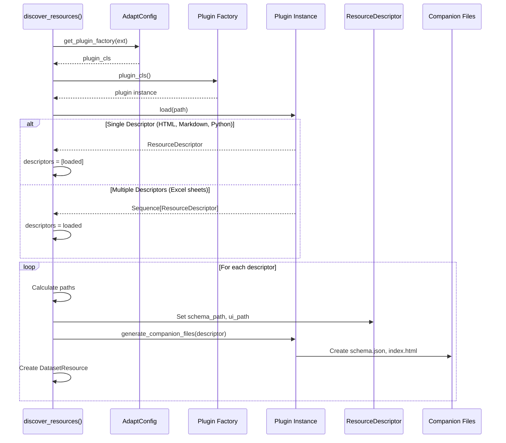
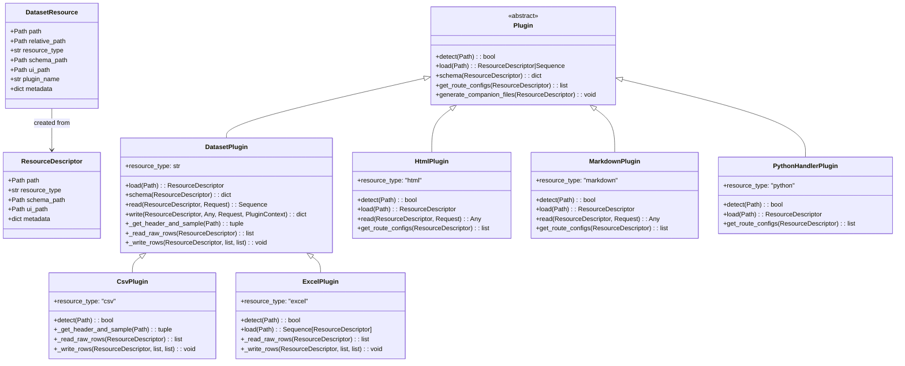
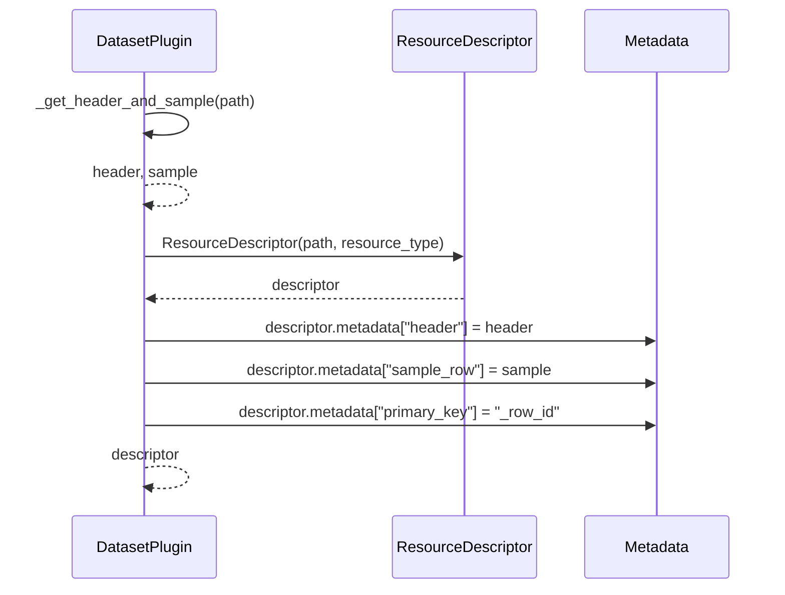
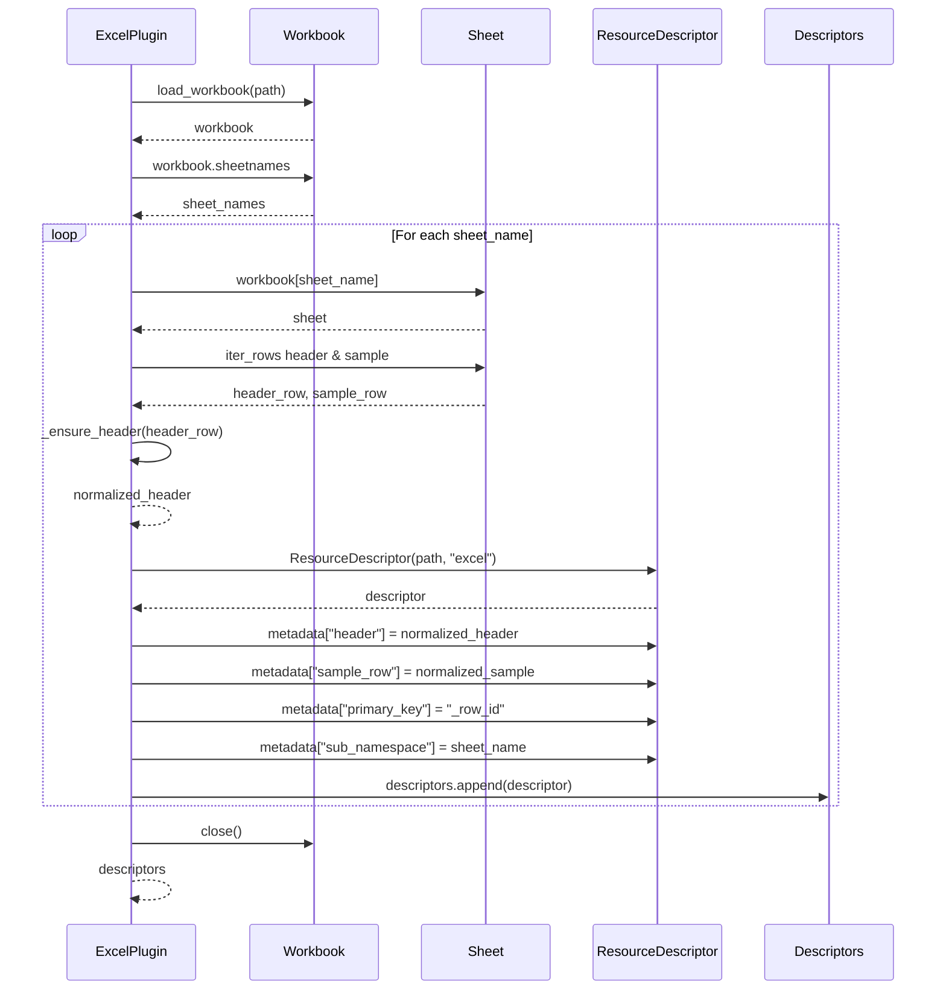
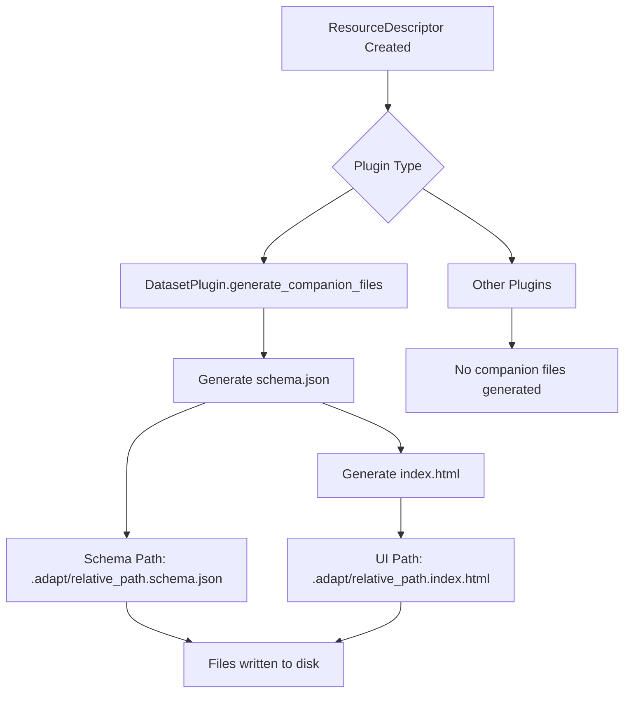

iLoveTux: Can you make a diagram of how the ResourceDescriptor is built up for the different plugins. Please be thorough and use sequence diagrams and mermaid diagrams and any other visual tool that will help me understand the flow.

# ResourceDescriptor Building Flow Diagrams

I'll create comprehensive diagrams to illustrate how ResourceDescriptors are built for different plugins in the Adapt system. These diagrams show the discovery process, plugin-specific loading mechanisms, and the resulting data structures.

## Sequence Diagram: Resource Discovery and Descriptor Building



## Flowchart: Plugin-Specific ResourceDescriptor Building

```mermaid
flowchart TD
    A[File Detected] --> B{Plugin Type}
    
    B --> C[DatasetPlugin.load()]
    C --> D[Get header and sample]
    D --> E[Create ResourceDescriptor]
    E --> F[Set metadata: header, sample_row, primary_key]
    
    B --> G[ExcelPlugin.load()]
    G --> H[Load workbook]
    H --> I[For each sheet]
    I --> J[Get sheet header & sample]
    J --> K[Create ResourceDescriptor per sheet]
    K --> L[Set metadata: header, sample_row, primary_key, sub_namespace]
    
    B --> M[HtmlPlugin.load()]
    M --> N[Create basic ResourceDescriptor]
    
    B --> O[MarkdownPlugin.load()]
    O --> P[Create basic ResourceDescriptor]
    
    B --> Q[PythonHandlerPlugin.load()]
    Q --> R[Create basic ResourceDescriptor]
    
    F --> S[Common Processing]
    L --> S
    N --> S
    P --> S
    R --> S
    
    S --> T[Set schema_path & ui_path]
    T --> U[Generate companion files]
    U --> V[Create DatasetResource]
```

## Class Diagram: ResourceDescriptor and Related Classes



## Detailed Sequence: DatasetPlugin ResourceDescriptor Building



## Detailed Sequence: ExcelPlugin Multi-Sheet ResourceDescriptor Building



## Metadata Structure by Plugin Type

| Plugin Type | Metadata Keys | Description |
|-------------|---------------|-------------|
| **CSV** | `header`, `sample_row`, `primary_key` | Column headers, sample data row, primary key field |
| **Excel** | `header`, `sample_row`, `primary_key`, `sub_namespace` | Same as CSV plus sheet name for multi-sheet files |
| **HTML** | None | No additional metadata needed |
| **Markdown** | None | No additional metadata needed |
| **Python** | None | No additional metadata needed |

## Companion File Generation Flow



These diagrams illustrate the complete flow of how ResourceDescriptors are built across different plugin types, showing both the common patterns and plugin-specific variations. The DatasetPlugin-based plugins (CSV, Excel) perform more complex metadata extraction, while content plugins (HTML, Markdown, Python) use simpler descriptor creation.