# Architecture

[Previous](plugin_development) | [Next](troubleshooting) | [Index](index)

This document describes the internal architecture of Adapt, including system components, data flow, and design patterns.

## System Overview

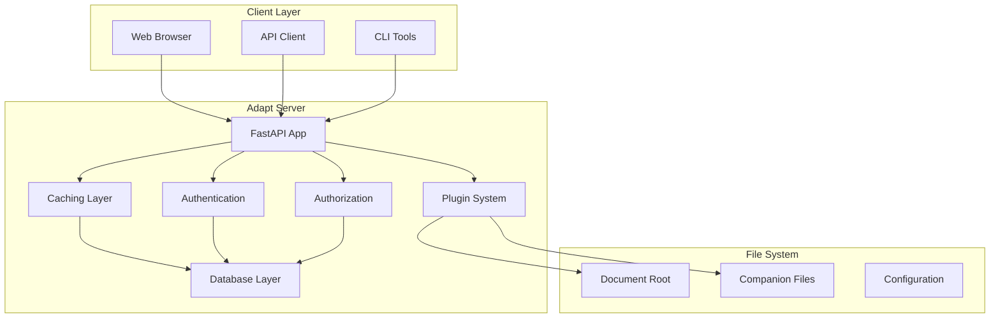

## Core Components

### 1. FastAPI Application

The central web framework handling HTTP requests:

- **Routing**: Dynamic route generation based on discovered resources
- **Middleware**: Authentication, CORS, security headers
- **Dependency Injection**: Request context and user information
- **Background Tasks**: Cleanup, monitoring, scheduled operations

### 2. Authentication System

Multi-layered authentication with session and API key support:

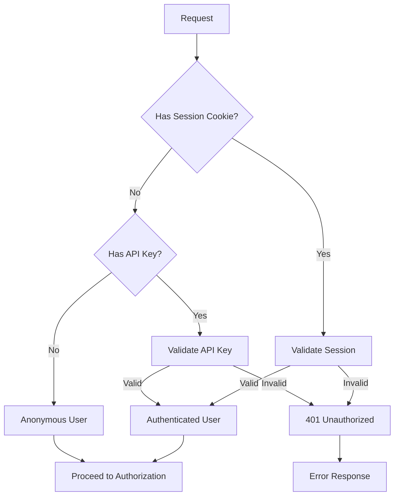

### 3. Authorization System

Role-Based Access Control (RBAC) with resource-level permissions:

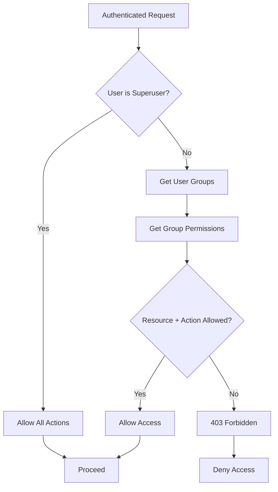

### 4. Plugin System

Extensible architecture for handling different file types:

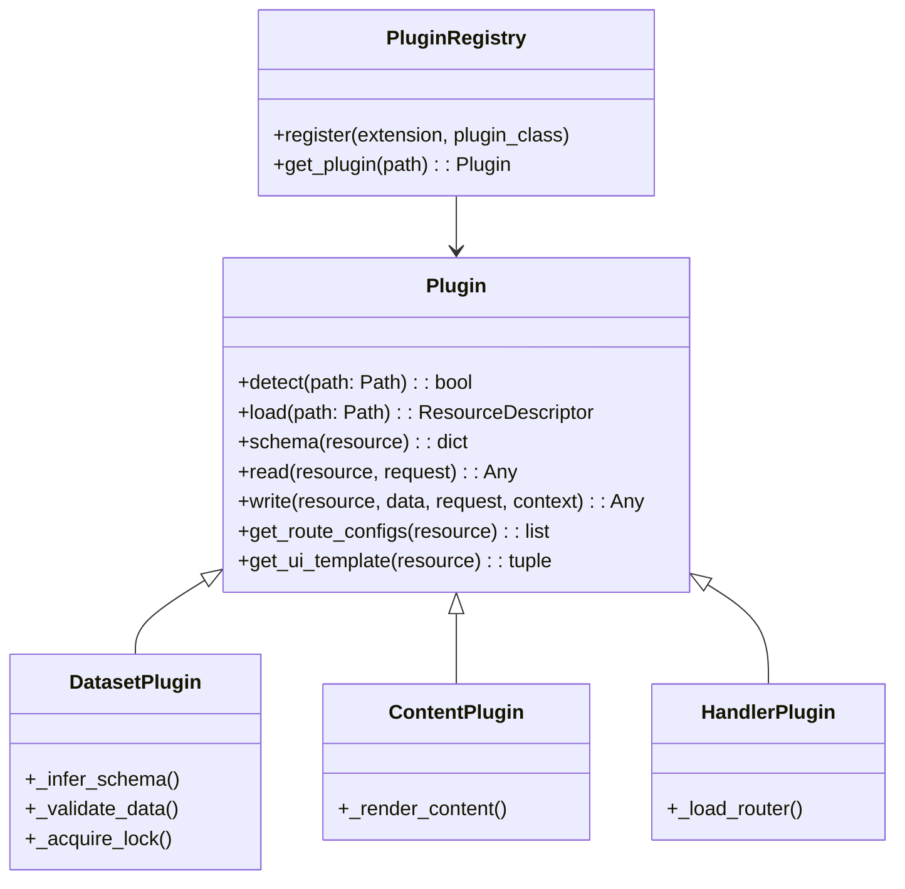

## Data Flow

### Request Processing Flow

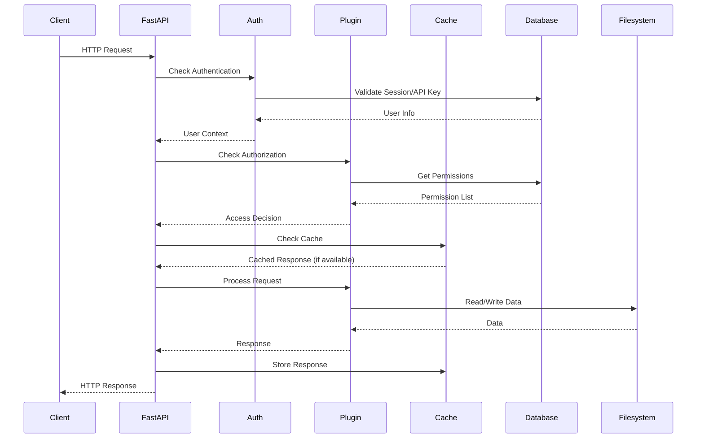

### File Discovery Flow

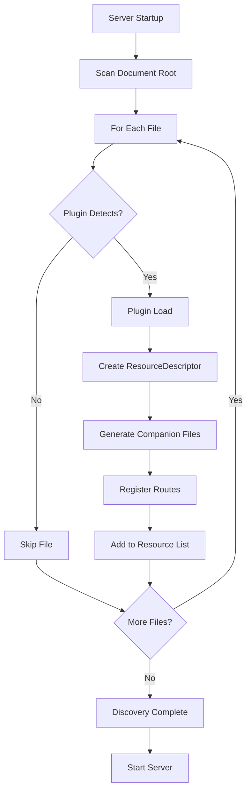

## Database Schema

Adapt uses SQLite with the following core tables:

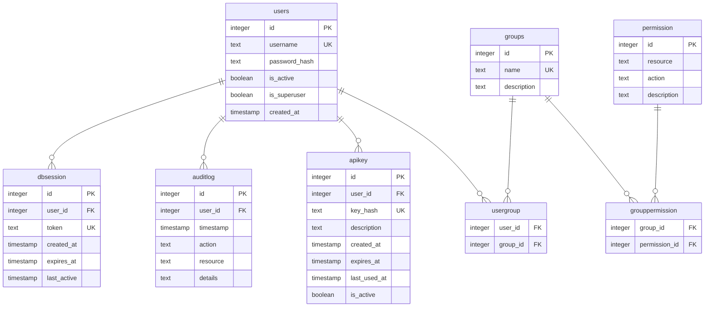

## Caching Architecture

Multi-level caching system:

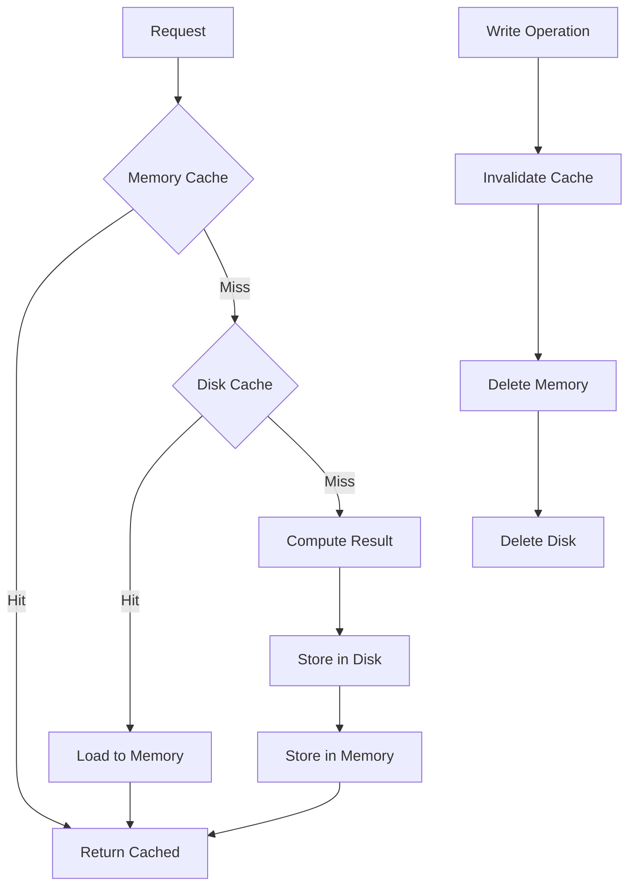

### Cache Key Strategy

- **Read Operations**: `read:{resource_name}:{params_hash}`
- **Schema Operations**: `schema:{resource_name}`
- **UI Templates**: `ui:{resource_name}:{user_id}`

## Locking System

File-level locking for safe concurrent access:

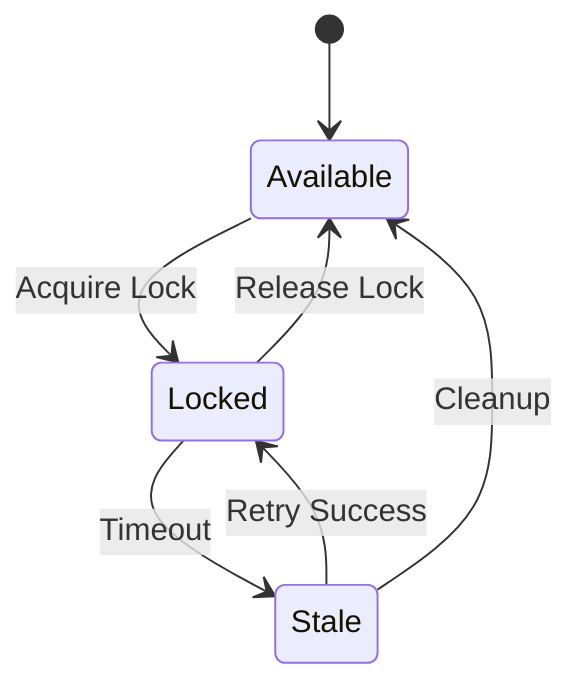

### Lock Implementation

```python
# Optimistic locking with database constraints
def acquire_lock(resource_path: str, user_id: int) -> bool:
    try:
        # Insert lock record (fails if exists)
        db.execute("""
            INSERT INTO filelock (resource_path, user_id, expires_at)
            VALUES (?, ?, datetime('now', '+5 minutes'))
        """, (resource_path, user_id))
        return True
    except IntegrityError:
        # Check if existing lock is expired
        existing = db.execute("""
            SELECT user_id, expires_at FROM filelock
            WHERE resource_path = ?
        """, (resource_path,)).fetchone()

        if existing and datetime.now() > existing.expires_at:
            # Clean up stale lock and retry
            db.execute("DELETE FROM filelock WHERE resource_path = ?", (resource_path,))
            return acquire_lock(resource_path, user_id)

        return False
```

## Plugin Architecture Deep Dive

### Plugin Loading

```mermaid
flowchart TD
    A[Server Startup] --> B[Load Plugin Registry]
    B --> C[For Each Extension]
    C --> D[Import Plugin Class]
    D --> E[Instantiate Plugin]
    E --> F[Register Plugin]
    F --> G{More Extensions?}
    G -->|Yes| C
    G -->|No| H[Plugins Ready]

    I[File Discovery] --> J[Get Plugin for Extension]
    J --> K[Plugin.detect(path)]
    K -->|True| L[Plugin.load(path)]
    K -->|False| M[Next Plugin]
```

### Route Generation

```mermaid
flowchart TD
    A[Resource Loaded] --> B[Plugin.get_route_configs()]
    B --> C[For Each Route Config]
    C --> D[Create FastAPI Router]
    D --> E[Add Authentication]
    E --> F[Add Authorization]
    F --> G[Add Caching]
    G --> H[Register with App]
    H --> I{More Routes?}
    I -->|Yes| C
    I -->|No| J[Routes Active]
```

## Security Architecture

### Defense in Depth

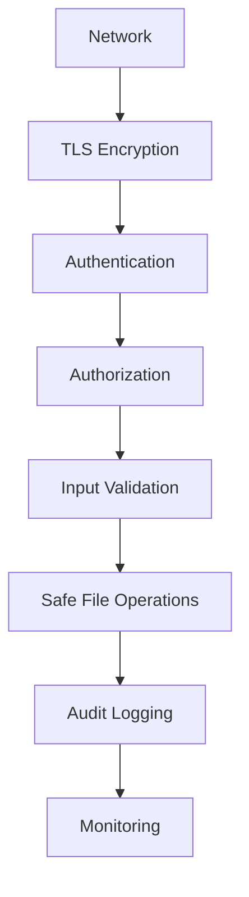

### Threat Model

**Attack Vectors Considered:**
- Network eavesdropping (mitigated by TLS)
- Authentication bypass (multi-factor checks)
- Authorization bypass (RBAC enforcement)
- Data injection (schema validation)
- File system attacks (path validation, safe writes)
- DoS attacks (rate limiting, resource limits)

## Performance Characteristics

### Scalability Factors

- **Concurrent Users**: Limited by database connection pool
- **File Size**: Streaming for large files, pagination for datasets
- **Plugin Count**: Minimal overhead per plugin
- **Cache Hit Rate**: Dramatically improves response times

### Performance Metrics

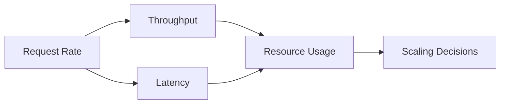

### Optimization Strategies

1. **Caching**: GET responses cached with TTL
2. **Async I/O**: Non-blocking file operations
3. **Connection Pooling**: Database connection reuse
4. **Lazy Loading**: Resources loaded on demand
5. **Background Processing**: Cleanup and maintenance tasks

## Deployment Patterns

### Single Server

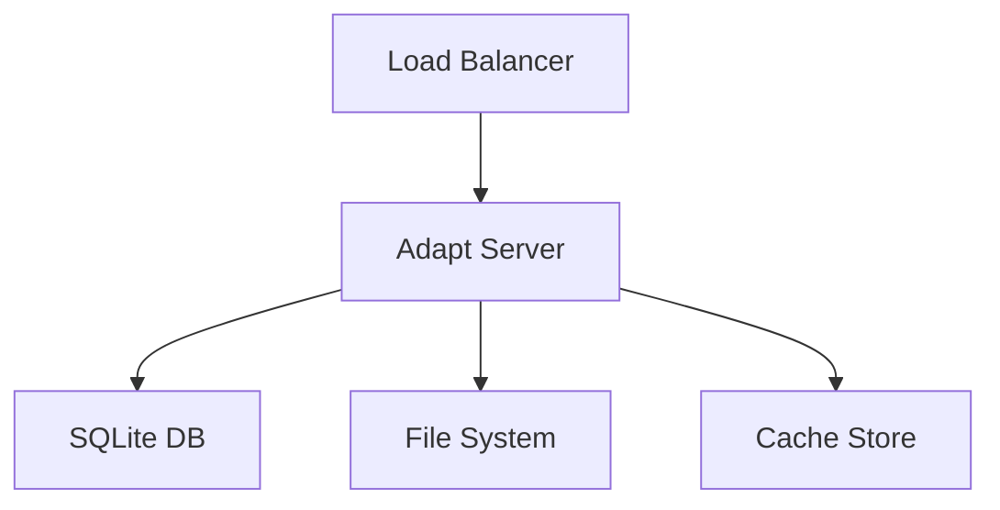

### Multi-Server

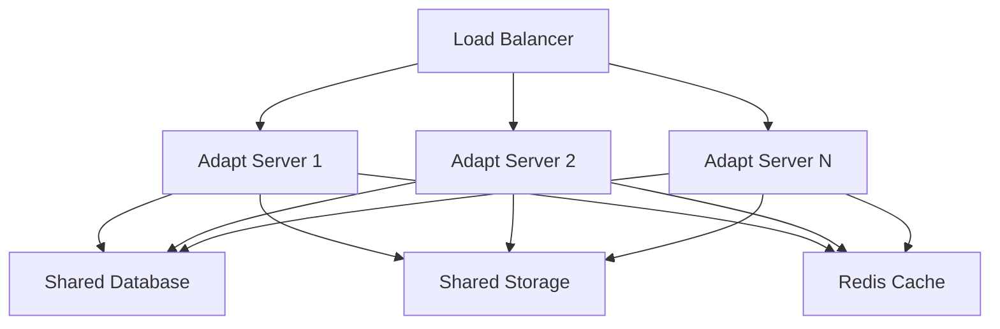

### Container Deployment

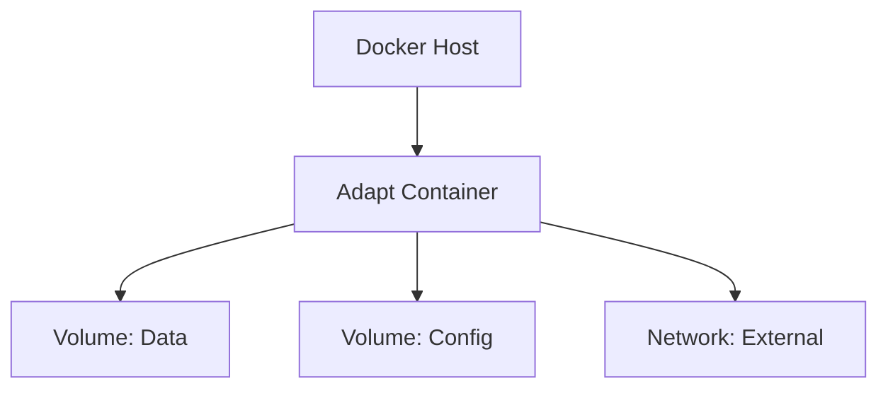

## Monitoring and Observability

### Metrics Collection

- **Request Metrics**: Count, latency, error rates
- **Resource Metrics**: CPU, memory, disk I/O
- **Business Metrics**: Active users, API calls, data volumes
- **Security Metrics**: Failed logins, permission denials

### Logging Strategy

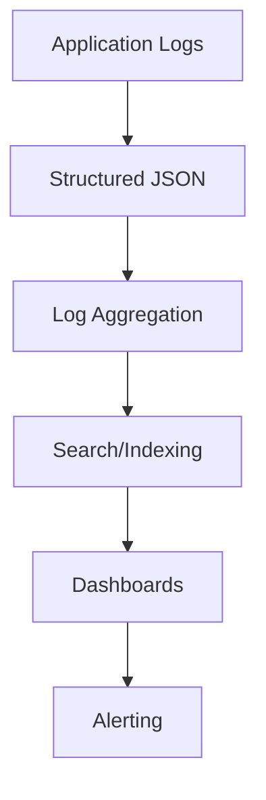

### Health Checks

- **Application Health**: `/health` endpoint
- **Database Health**: Connection and query tests
- **Filesystem Health**: Read/write permissions
- **Dependency Health**: Plugin and external service checks

## Future Architecture

### Planned Extensions

- **GraphQL Support**: Query interface for complex data relationships
- **Real-time Updates**: WebSocket support for live data
- **Plugin Marketplace**: Centralized plugin distribution
- **Multi-tenancy**: Isolated workspaces for different users/teams
- **API Gateway**: Advanced routing and transformation capabilities

This architecture document provides a comprehensive view of Adapt's design, enabling developers to understand, extend, and maintain the system effectively.

[Previous](plugin_development) | [Next](troubleshooting) | [Index](index)
