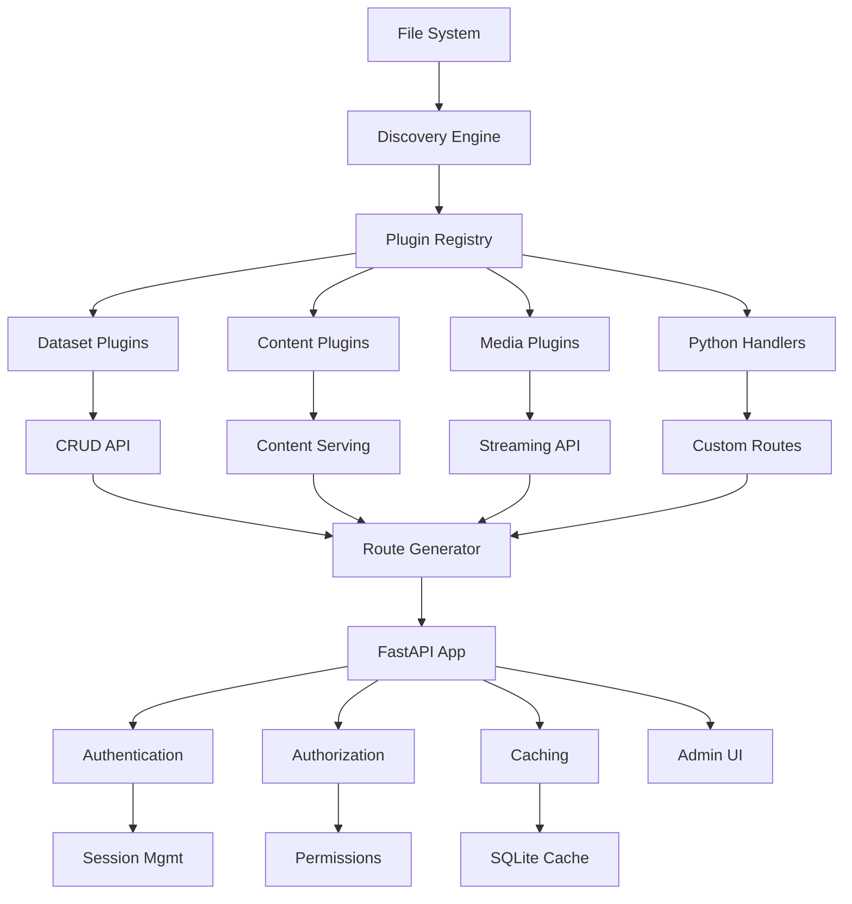

# Overview

[Next](installation) | [Index](index)

## What is Adapt?

Adapt is a lightweight, FastAPI-powered adaptive server that automatically turns files and Python modules into fully functional REST APIs and interactive HTML user interfaces. It treats your filesystem as a backend database, providing instant APIs for CSV files, Excel spreadsheets, Parquet datasets, media files, and custom Python handlers.

## Key Features

- **Automatic API Generation**: Drop a file into a directory and get instant CRUD REST endpoints
- **Rich HTML UIs**: Built-in DataTables interfaces with sorting, searching, and inline editing
- **Media Streaming**: HTTP streaming for audio/video files with gallery UIs
- **Python Handlers**: Custom business logic via Python files with auto-registered FastAPI routers
- **Security Layer**: Complete authentication, authorization, and audit logging system
- **Admin Interface**: Web-based administration for users, groups, permissions, and system monitoring
- **Caching System**: SQLite-backed caching for performance optimization
- **Plugin Architecture**: Extensible system for supporting new file types and handlers
- **Safe Writes**: Atomic file operations with locking to prevent data corruption

## How It Works

Adapt scans your document root directory on startup, detects supported files, and automatically generates:

- REST API endpoints (`/api/*`)
- HTML user interfaces (`/ui/*`)
- JSON schemas (`/schema/*`)
- Streaming media endpoints (`/media/*`)
- Direct content serving for HTML/Markdown files
- Health check endpoint (`/health`)

## Architecture Overview

## Supported File Types

| File Type | Generated Resources |
|-----------|-------------------|
| `.csv` | CRUD API, DataTables UI, Schema |
| `.xlsx`/`.xls` | Per-sheet CRUD APIs, UIs, Schemas |
| `.parquet` | CRUD API, DataTables UI, Schema |
| `.html` | Direct content serving |
| `.txt` | Direct content serving (same as `.html`) |
| `.md` | Rendered Markdown content |
| `.mp4`/`.mp3`/etc. | Streaming endpoints, Player UIs, Gallery |
| `.py` | Custom FastAPI router mounting |
| unrecognized | Direct content serving |

## Core Principles

- **Local-First**: All data stays in your filesystem
- **Zero Configuration**: Works out of the box with sensible defaults
- **Security-First**: Built-in authentication and authorization
- **Extensible**: Plugin system for custom file types and logic
- **Safe Operations**: Atomic writes and locking prevent data corruption
- **Developer-Friendly**: Python-based with familiar FastAPI patterns

## Use Cases

- **Data Dashboards**: Quick UIs for CSV/Excel data exploration
- **Media Libraries**: Personal streaming servers for audio/video content
- **API Prototyping**: Rapid REST API development from files
- **Content Management**: Serve HTML/Markdown documentation
- **Custom Applications**: Extend with Python handlers for business logic
- **Internal Tools**: Lightweight admin interfaces and data management

## Getting Started

To get started with Adapt:

1. Install: `pip install adapt-server`
2. Create a directory with your data files
3. Run: `adapt serve ./your-data-directory`
4. Open http://localhost:8000 in your browser

Adapt will automatically discover your files and generate APIs and UIs.

[Next](installation) | [Index](index)
