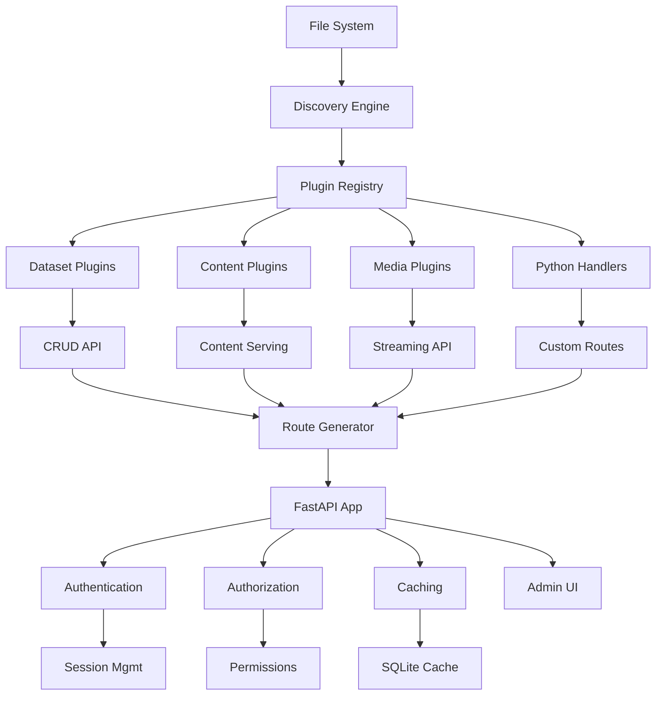

# Overview

## What is Adapt?

Adapt is a lightweight, FastAPI-powered adaptive server. It automatically turns files and Python modules into REST APIs and interactive HTML user interfaces. It treats your filesystem as a backend database. This gives instant APIs for CSV files, Excel spreadsheets, Parquet datasets, media files, and custom Python handlers.

## Key Features

- **Automatic API Generation**: Drop a file into a directory and get instant CRUD REST endpoints
- **Rich HTML UIs**: Built-in DataTables interfaces with sorting, searching, and inline editing
- **Media Streaming**: HTTP streaming for audio/video files with gallery UIs
- **Python Handlers**: Custom business logic via Python files with auto-registered FastAPI routers
- **Security Layer**: Authentication, authorization, and audit records for security events and dataset mutations
- **Admin Interface**: Web-based administration for users, groups, permissions, and system monitoring
- **Caching System**: SQLite-backed caching for performance optimization
- **Plugin Architecture**: Extensible system for supporting new file types and handlers
- **Safer Writes**: Per-resource locking and atomic target replacement where supported
- **Full-Text Search**: Permission-filtered search (`/search`) across datasets, documents, and media metadata in one ranked list
- **MCP Interface**: An agent-facing [Model Context Protocol](https://modelcontextprotocol.io) server at `/mcp`. It exposes the same permission-filtered read, write, and search as tools

## How It Works

Adapt scans your document root directory on startup, detects supported files, and automatically generates:

- REST API endpoints (`/api/*`)
- HTML user interfaces (`/ui/*`)
- JSON schemas (`/schema/*`)
- Streaming media endpoints (`/media/*`)
- Direct content serving for HTML/Markdown files
- Health check endpoint (`/health`)

## Architecture Overview

```mermaid
graph TB
    A[File System] --> B[Discovery Engine]
    B --> C[Plugin Registry]
    C --> D[Dataset Plugins]
    C --> E[Content Plugins]
    C --> F[Media Plugins]
    C --> G[Python Handlers]
    
    D --> H[CRUD API]
    E --> I[Content Serving]
    F --> J[Streaming API]
    G --> K[Custom Routes]
    
    H --> L[Route Generator]
    I --> L
    J --> L
    K --> L
    
    L --> M[FastAPI App]
    M --> N[Authentication]
    M --> O[Authorization]
    M --> P[Caching]
    M --> Q[Admin UI]
    
    N --> R[Session Mgmt]
    O --> S[Permissions]
    P --> T[SQLite Cache]
```

## Supported File Types

| File Type | Generated Resources |
|-----------|-------------------|
| `.csv` | CRUD API, DataTables UI, Schema |
| `.xlsx` | Per-sheet CRUD APIs, UIs, Schemas |
| `.xls` | Per-sheet read APIs, read-only UIs, Schemas |
| `.parquet` | CRUD API, DataTables UI, Schema |
| `.html` | Direct content serving |
| `.txt`, `.pdf`, `.json`, `.xml`, `.svg` | Direct generic file serving |
| `.png`, `.jpg`, `.jpeg`, `.gif`, `.webp` | Direct generic file serving |
| `.md` | Rendered Markdown content |
| `.mp4`, `.mp3`, `.avi`, `.mkv`, `.webm`, `.ogg`, `.wav` | Streaming endpoints, Player UIs, Gallery |
| `.py` | Custom FastAPI router mounting |

The Excel plugin reads legacy `.xls` workbooks. These resources are read-only.
Before you modify a legacy workbook through Adapt, convert it to `.xlsx`. If
you do not add a plugin mapping, Adapt does not discover an unregistered
extension. See [Known Limitations](known_limitations.md#legacy-excel-files).

## Core Principles

- **Local-First**: All data stays in your filesystem
- **Zero Configuration**: Works by default with sensible defaults
- **Security-First**: Built-in authentication and authorization
- **Extensible**: Plugin system for custom file types and logic
- **Safer Operations**: Atomic replacement and locking reduce write-conflict and partial-write risks
- **Developer-Friendly**: Python-based with familiar FastAPI patterns

## Use Cases

- **Data Dashboards**: Quick UIs for CSV and Excel data exploration
- **Media Libraries**: Personal streaming servers for audio/video content
- **API Prototyping**: Rapid REST API development from files
- **Content Management**: Serve HTML/Markdown documentation
- **Custom Applications**: Extend with Python handlers for business logic
- **Internal Tools**: Lightweight admin interfaces and data management

## Getting Started

To get started with Adapt:

1. Install: `pip install adapt-server`
2. Create a directory with your data files
3. Run: `adapt serve ./your-data-directory`
4. Open http://localhost:8000 in your browser

Adapt will automatically discover your files and generate APIs and UIs.

Manual navigation: [Index](index.md) | [Next: Installation](installation.md)
