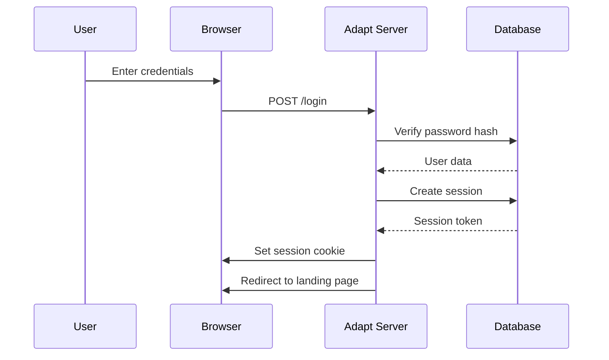
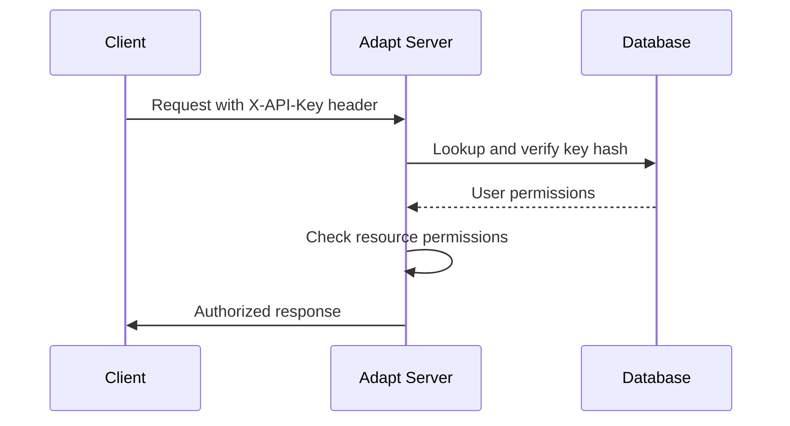
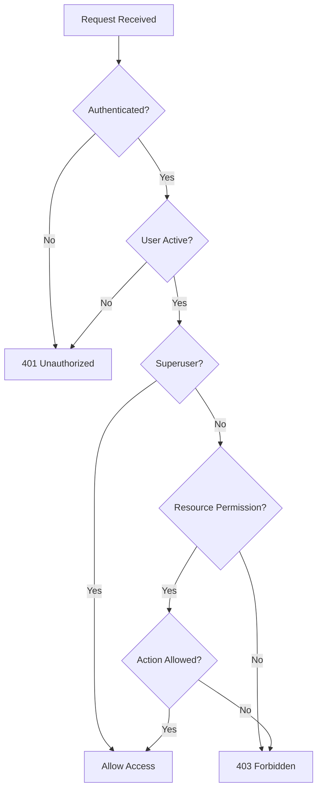
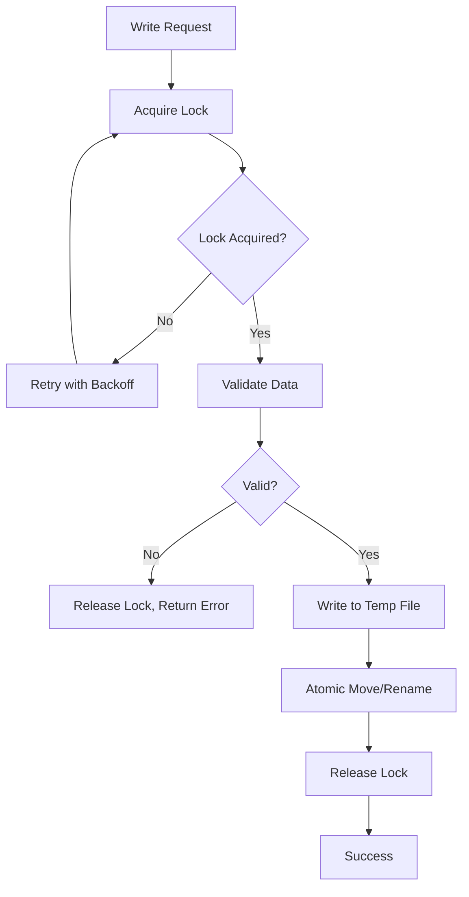

# Security

[Previous](admin_guide) | [Next](configuration) | [Index](index)

Adapt provides comprehensive security features for protecting your data and APIs. This guide covers authentication, authorization, encryption, and security best practices.

## Authentication System

### Session-Based Authentication

Adapt uses secure cookie-based sessions for web UI access:

- **Cookie Security**: HttpOnly, Secure, SameSite flags
- **Session Storage**: Server-side storage in SQLite database
- **Expiration**: 7-day sessions with sliding renewal
- **Cleanup**: Automatic removal of expired sessions

#### Login Process



### API Key Authentication

For programmatic access:

- **Header-Based**: `X-API-Key: <your-key>` header
- **Secure Storage**: SHA-256 hashed keys in database
- **Optional Expiration**: Keys can have expiration dates
- **Usage Tracking**: Last-used timestamps

#### API Key Flow



## Authorization System

### Role-Based Access Control (RBAC)

Adapt implements RBAC with users, groups, and permissions:

- **Users**: Individual accounts with credentials
- **Groups**: Collections of users for permission inheritance
- **Permissions**: Resource-level access control (read/write)

### Permission Model

Permissions are defined as `resource:action` pairs:

- `products:read` - View products data
- `inventory:write` - Modify inventory data
- `admin:*` - Administrative access

### Permission Enforcement



### Row-Level Security (RLS)

Plugins can implement row-level filtering:

```python
def filter_for_user(self, resource, user, data):
    """Filter data based on user context"""
    if user.is_superuser:
        return data
    # Return only user's department data
    return [row for row in data if row['department'] == user.department]
```

## Password Security

### Hashing
- **Algorithm**: PBKDF2 with SHA-256
- **Iterations**: 100,000 (configurable)
- **Salt**: Per-user random salts
- **Timing Attack Protection**: Constant-time comparison

### Password Policies
Configure in `conf.json`:

```json
{
  "password_policy": {
    "min_length": 8,
    "require_uppercase": true,
    "require_lowercase": true,
    "require_numbers": true,
    "require_symbols": false,
    "prevent_reuse": true,
    "max_age_days": 90
  }
}
```

## Data Protection

### Encryption in Transit

#### TLS Configuration
```json
{
  "tls_cert": "/path/to/certificate.pem",
  "tls_key": "/path/to/private-key.pem",
  "secure_cookies": true
}
```

#### Certificate Requirements
- Valid certificate from trusted CA
- Proper domain matching
- Sufficient key length (2048-bit RSA minimum)
- Regular renewal before expiration

### Encryption at Rest

- **Database**: SQLite with optional SQLCipher
- **File Data**: Files stored unencrypted (encrypt at filesystem level if needed)
- **Backups**: Encrypt backup files

### Safe Write Operations

Adapt ensures data integrity during writes:



#### Lock Management
- **Database Constraints**: Prevent concurrent lock acquisition
- **Timeout**: 30-second maximum wait with exponential backoff
- **Cleanup**: Automatic removal of stale locks (5-minute TTL)
- **Monitoring**: Lock status visible in admin UI

## Audit Logging

### Audit Events

All security-critical actions are logged:

- **Authentication**: Login, logout, failed attempts
- **Authorization**: Permission checks, access denials
- **Data Operations**: Create, read, update, delete actions
- **Admin Actions**: User/group/permission management
- **System Events**: Server start/stop, configuration changes

### Audit Log Structure

```json
{
  "timestamp": "2024-01-15T10:30:00Z",
  "user_id": 123,
  "action": "login",
  "resource": "auth",
  "ip_address": "192.168.1.100",
  "user_agent": "Mozilla/5.0...",
  "details": {
    "success": true,
    "method": "password"
  }
}
```

### Audit Log Management

```bash
# View recent audit events
curl -H "X-API-Key: key" http://localhost:8000/admin/api/audit

# Filter by user
curl -H "X-API-Key: key" "http://localhost:8000/admin/api/audit?user=123"

# Filter by action
curl -H "X-API-Key: key" "http://localhost:8000/admin/api/audit?action=delete"
```

## Security Monitoring

### Real-time Monitoring

#### Failed Authentication Alerts
- Track failed login attempts
- Implement account lockout after multiple failures
- Alert on suspicious patterns

#### Permission Changes
- Monitor permission modifications
- Alert on privilege escalation
- Review permission audit logs regularly

### Security Metrics

```json
{
  "active_sessions": 45,
  "failed_logins_last_hour": 3,
  "active_locks": 2,
  "cache_hit_rate": 0.85,
  "audit_events_last_day": 1250
}
```

## Threat Mitigation

### Common Threats

#### Brute Force Attacks
- **Mitigation**: Account lockout, rate limiting, CAPTCHA
- **Detection**: Monitor failed login patterns

#### Session Hijacking
- **Mitigation**: Secure cookies, session expiration, IP binding
- **Detection**: Monitor anomalous session usage

#### Data Exfiltration
- **Mitigation**: Permission controls, audit logging, RLS
- **Detection**: Monitor large data exports, unusual access patterns

#### Injection Attacks
- **Mitigation**: Input validation, parameterized queries, schema validation
- **Detection**: Monitor for unusual query patterns

### Incident Response

#### Detection Phase
1. Monitor alerts and logs
2. Identify affected systems/users
3. Assess impact scope

#### Containment Phase
1. Disable compromised accounts
2. Revoke suspicious API keys
3. Block malicious IP addresses

#### Recovery Phase
1. Restore from clean backups
2. Reset passwords for affected users
3. Review and update security policies

#### Lessons Learned
1. Document incident details
2. Update security measures
3. Conduct post-mortem analysis

## Compliance

### Security Standards

#### GDPR Compliance
- **Data Minimization**: Collect only necessary data
- **Consent Management**: Clear user consent for data processing
- **Right to Erasure**: Ability to delete user data
- **Audit Trails**: Complete data access logs

#### SOC 2 Compliance
- **Access Controls**: RBAC and permission management
- **Change Management**: Audit logging for system changes
- **Incident Response**: Documented security incident procedures
- **Monitoring**: Continuous security monitoring

### Compliance Features

- **Data Retention**: Configurable audit log retention
- **Access Reviews**: Regular permission audits
- **Encryption**: TLS and data encryption options
- **Backup Security**: Encrypted backup procedures

## Security Configuration

### Production Security Settings

```json
{
  "secure_cookies": true,
  "session_timeout": 3600,
  "password_iterations": 200000,
  "audit_retention_days": 365,
  "max_login_attempts": 5,
  "lockout_duration": 900,
  "rate_limit_requests": 100,
  "rate_limit_window": 60
}
```

### Security Headers

Adapt automatically sets security headers:

```
X-Content-Type-Options: nosniff
X-Frame-Options: DENY
X-XSS-Protection: 1; mode=block
Strict-Transport-Security: max-age=31536000
Content-Security-Policy: default-src 'self'
```

## Best Practices

### Development Security
- **Code Reviews**: Security-focused code reviews
- **Dependency Scanning**: Regular vulnerability checks
- **Input Validation**: Validate all inputs
- **Error Handling**: Don't leak sensitive information

### Operational Security
- **Regular Updates**: Keep dependencies updated
- **Backup Security**: Encrypt and secure backups
- **Access Management**: Least privilege principle
- **Monitoring**: Continuous security monitoring

### User Security
- **Password Hygiene**: Strong, unique passwords
- **Multi-Factor Authentication**: When available
- **API Key Security**: Secure key storage and rotation
- **Session Management**: Log out when finished

## Security Checklist

### Pre-Deployment
- [ ] TLS certificates configured
- [ ] Strong passwords enforced
- [ ] Unnecessary services disabled
- [ ] Firewall rules configured
- [ ] Security headers verified

### Ongoing Maintenance
- [ ] Regular security updates
- [ ] Password rotation policy
- [ ] Permission audits
- [ ] Log monitoring
- [ ] Backup verification

### Incident Readiness
- [ ] Incident response plan documented
- [ ] Contact lists maintained
- [ ] Backup restoration tested
- [ ] Communication procedures defined

This comprehensive security guide ensures your Adapt deployment remains secure and compliant with industry standards.

[Previous](admin_guide) | [Next](configuration) | [Index](index)
