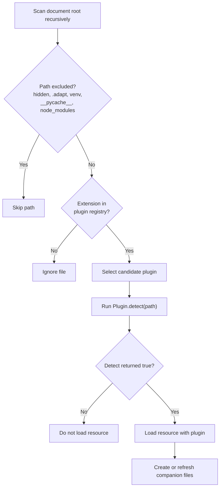
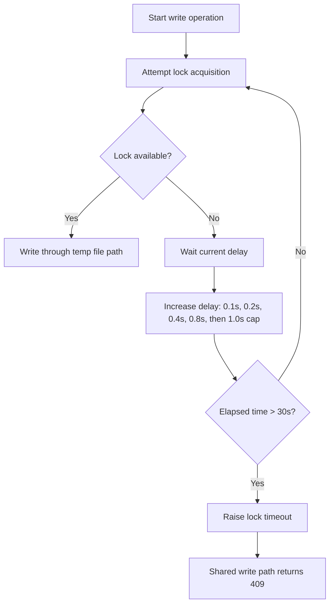

# Adapt Specification: Core Engine

> **Status:** This document describes the current implementation. The running
> code on `main` wins if it differs. See the
> [documentation contract](../documentation-contract.md) and [user manual](../manual/index.md).

## 1. File discovery

Adapt recursively scans the document root. It ignores hidden paths, `.adapt`,
virtual environments, `__pycache__`, and `node_modules`. Discovery selects a
candidate plugin from `AdaptConfig.plugin_registry` by file extension. It then
calls `Plugin.detect()`. Discovery loads the file only when this method returns
`True`.



The default registry contains these mappings:

| Extensions | Plugin |
| --- | --- |
| `.csv` | CSV |
| `.xlsx`, `.xls` | Excel |
| `.parquet` | Parquet |
| `.py` | Python handler |
| `.html` | HTML |
| `.md` | Markdown |
| `.txt`, `.pdf`, `.json`, `.xml`, `.svg` | Generic file |
| `.png`, `.jpg`, `.jpeg`, `.gif`, `.webp` | Generic file |
| `.mp4`, `.mp3`, `.avi`, `.mkv`, `.webm`, `.ogg`, `.wav` | Media |

The Excel plugin reads `.xlsx` and legacy `.xls` workbooks. Legacy `.xls`
workbooks are read-only. Discovery ignores extensions that are not in the
registry.

## 2. Dataset engine

The dataset engine handles CSV files, Excel sheets, and Parquet files. It
provides row reads, query controls, and mutation envelopes for create, update,
and delete actions. Legacy `.xls` resources reject mutations with `405`. Row
identifiers are one-based positions named `_row_id`.

Schema inference uses `string`, `integer`, `number`, and `boolean` labels for
CSV and Excel samples. These labels control response conversion and UI columns.
They also validate supplied create and update values before a file is changed.

Each Excel sheet has a `sub_namespace`. For example, the `People` sheet in
`staff.xlsx` has these extensionless routes:

* `/api/staff/People/`
* `/schema/staff/People/`
* `/ui/staff/People/`

The extension-qualified `staff.xlsx/People` namespace is also mounted. A
sheet uses these companion paths:

* `.adapt/staff.People.schema.json`
* `.adapt/staff.People.index.html`
* `.adapt/staff.People.options.json`

The `header_row` option selects the one-based header row for CSV and Excel
resources. An absent or invalid value uses row 1.

## 3. Schema and companion files

Dataset plugins derive column metadata from the file. During discovery, Adapt
creates a missing schema file and DataTables UI file. Adapt reads an options
file but does not create it.

Generated schema files contain a `generated_by` marker. Adapt can refresh a
marked schema after the derived shape changes. Adapt preserves a hand-maintained
schema without this marker when its content differs from the derived schema.

Generated and hand-maintained schemas validate supplied create and update
fields. Adapt rejects unknown columns and values incompatible with the common
`string`, `integer`, `number`, and `boolean` types with `422`. It accepts and
normalizes numeric and boolean strings for compatibility with the generated
HTML form. Blank strings and `null` are permitted because the schema format
does not specify required columns or nullability. Unknown custom types remain
metadata and are not validated.

```json
{
  "type": "object",
  "name": "people",
  "primary_key": "_row_id",
  "columns": {
    "name": {"type": "string"},
    "age": {"type": "integer"}
  }
}
```

Dataset UI files use the `*.index.html` suffix. The media plugin is different.
It writes JSON metadata to its assigned `ui_path`.

## 4. Writes and locks

The lock manager stores one unique lock record for each resource. Built-in
dataset writes retry a held lock for up to 30 seconds. The retry delay starts
at 0.1 seconds, doubles, and stops at 1 second.



Locks expire after five minutes by default. Startup deletes locks older than
five minutes. The Admin UI can list, delete, and clean lock records.

CSV, XLSX, and Parquet writes use a temporary file. They replace the target
with `os.replace()` where supported. An `EXDEV` error uses a copy fallback.
These measures reduce conflict and partial-write risk. They do not remove all
races or make a writer uninterruptible.

Legacy `.xls` workbooks do not use this write path. The Excel plugin marks each
legacy sheet as read-only to prevent data loss from an incompatible writer.

The lock manager raises lock-specific exceptions for immediate conflicts and
exhausted retries. The shared write method converts both exceptions to `409`.

## 5. Cache

`adapt/cache.py` stores plugin cache entries in the SQLite `cache` table. The
table contains `key`, `value`, `expires_at`, `resource`, and `user` columns.

Plugins cache selected values. These values include parsed dataset rows,
schemas, rendered HTML or Markdown, and media metadata. Supported writes
invalidate resource cache entries.

Generic file bodies and streamed media bodies are not cached. Adapt does not
apply one automatic cache wrapper to every `GET` response.
